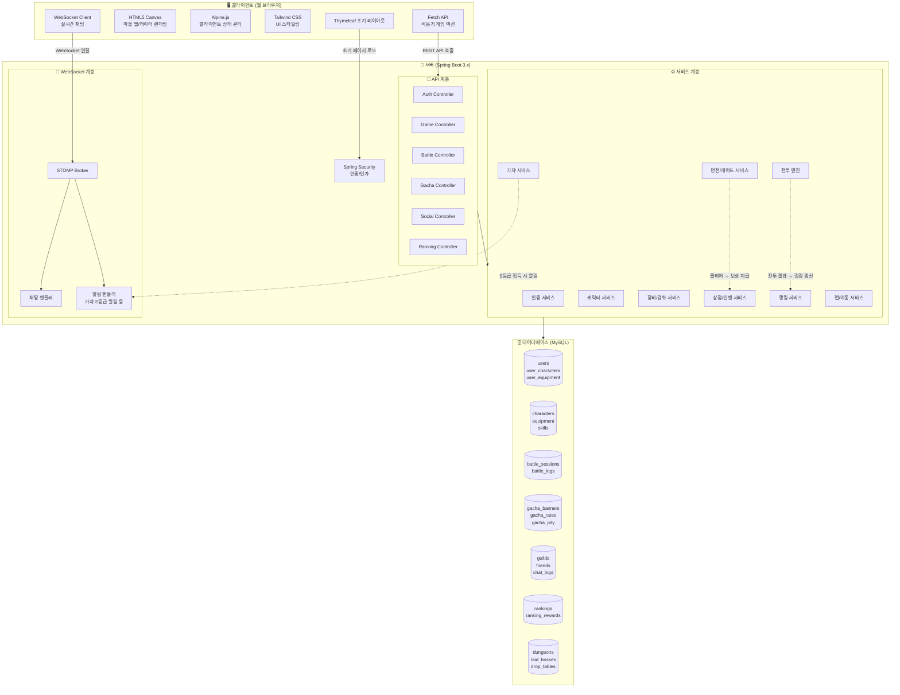
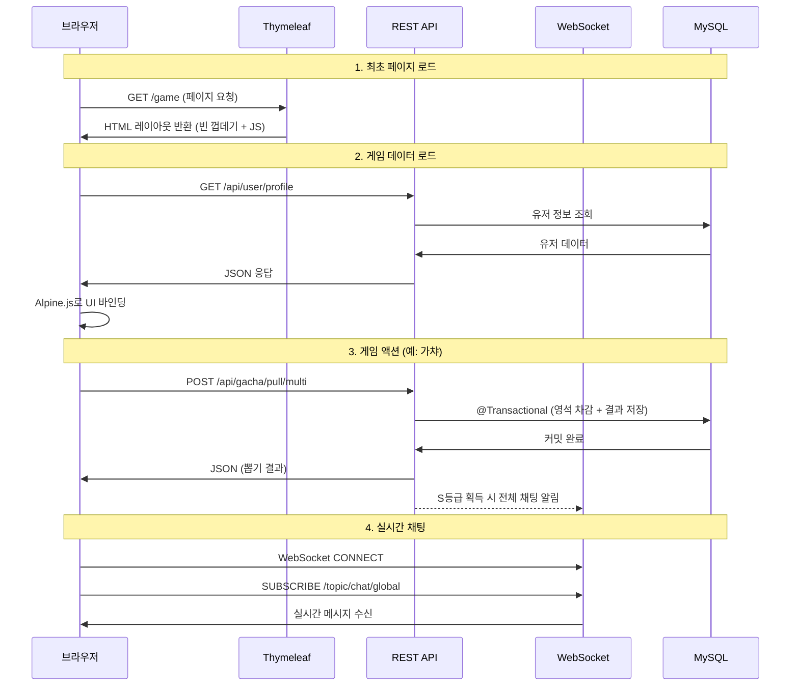
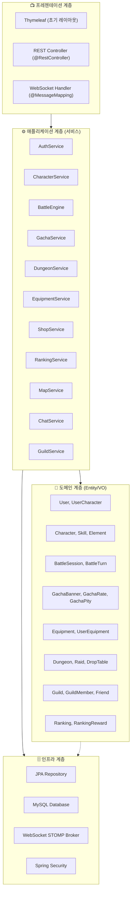
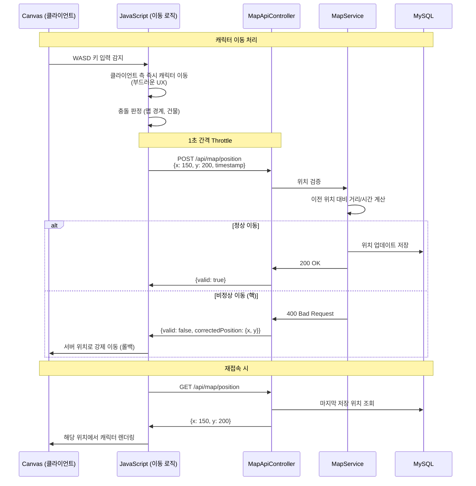
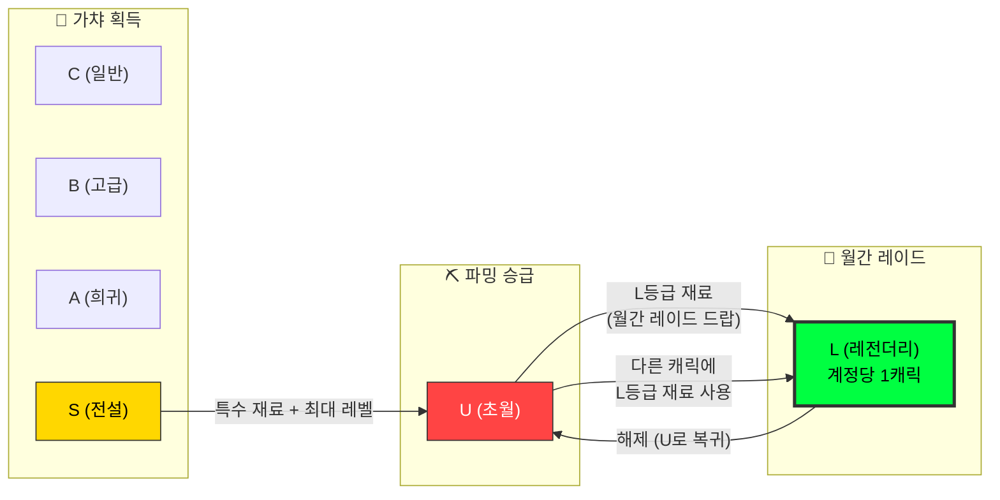
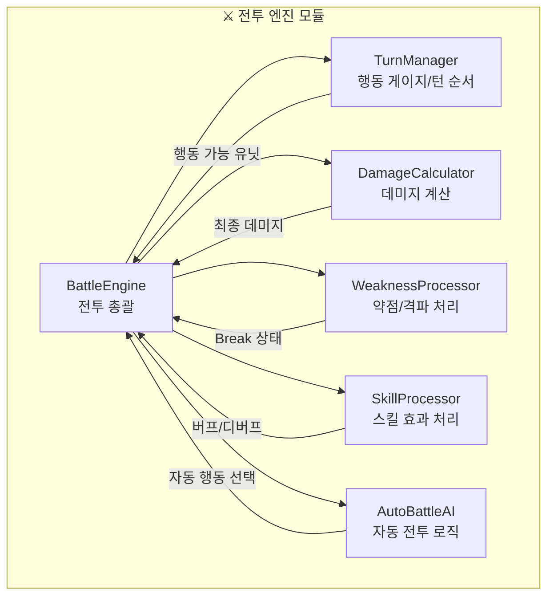

# ⚔️ Phase 1: 하이레벨 아키텍처 (HLD)

> **프로젝트**: 한월(韓月)  
> **작성일**: 2026-05-06  
> **상태**: 🔶 모험가 승인 대기 중

---

## 1. 시스템 아키텍처 전체 구조도



---

## 2. Headless API 성채 구조

### 2-1. 핵심 원칙

```
┌─────────────────────────────────────────────────────────┐
│                    Headless 아키텍처                      │
│                                                          │
│  ❌ 컨트롤러가 HTML을 반환하지 않는다                       │
│  ✅ 컨트롤러는 오직 JSON 데이터만 반환한다                  │
│  ✅ Thymeleaf는 초기 레이아웃(껍데기)만 렌더링한다           │
│  ✅ 모든 게임 로직은 Fetch API로 비동기 처리한다            │
│  ✅ 향후 Unity/Three.js 3D 클라이언트로 교체 가능하다       │
│                                                          │
└─────────────────────────────────────────────────────────┘
```

### 2-2. 요청/응답 흐름



---

## 3. 레이어드 아키텍처 (Layered Architecture)



### 3-1. 각 계층의 역할

| 계층 | 역할 | 핵심 규칙 |
|------|------|-----------|
| **프레젠테이션** | HTTP 요청 수신, JSON 응답 반환 | 비즈니스 로직 금지 |
| **애플리케이션** | 비즈니스 로직, 트랜잭션 관리 | `@Service`, `@Transactional` |
| **도메인** | 엔티티, 값 객체, 비즈니스 규칙 | JPA Entity, Enum |
| **인프라** | DB 접근, 외부 시스템 연동 | `@Repository` |

---

## 4. 모듈(패키지) 구조

```
src/main/java/com/hanwol/
├── config/                      # 설정
│   ├── SecurityConfig.java      # Spring Security 설정
│   ├── WebSocketConfig.java     # WebSocket STOMP 설정
│   └── WebConfig.java           # CORS, 인터셉터 등
│
├── domain/                      # 도메인 (Entity/Enum/VO)
│   ├── user/
│   │   ├── User.java
│   │   └── UserRole.java
│   ├── character/
│   │   ├── Character.java
│   │   ├── UserCharacter.java
│   │   ├── Element.java         # FIRE, WATER, WIND, EARTH, LIGHTNING
│   │   ├── CharacterRole.java   # SWORDSMAN, TAOIST, HEALER, ASSASSIN, GUARDIAN
│   │   └── Grade.java           # C, B, A, S, U, L
│   ├── equipment/
│   │   ├── Equipment.java
│   │   └── UserEquipment.java
│   ├── battle/
│   │   ├── BattleSession.java
│   │   ├── BattleTurn.java
│   │   └── BattleStatus.java
│   ├── gacha/
│   │   ├── GachaBanner.java
│   │   ├── GachaRate.java
│   │   └── GachaPity.java
│   ├── dungeon/
│   │   ├── Dungeon.java
│   │   ├── RaidBoss.java
│   │   └── DropTable.java
│   ├── social/
│   │   ├── Guild.java
│   │   ├── GuildMember.java
│   │   └── Friend.java
│   └── ranking/
│       ├── Ranking.java
│       └── RankingReward.java
│
├── repository/                  # JPA Repository
│   ├── user/
│   ├── character/
│   ├── equipment/
│   ├── battle/
│   ├── gacha/
│   ├── dungeon/
│   ├── social/
│   └── ranking/
│
├── service/                     # 비즈니스 로직
│   ├── auth/
│   │   └── AuthService.java
│   ├── character/
│   │   └── CharacterService.java
│   ├── battle/
│   │   ├── BattleEngine.java        # 전투 핵심 엔진
│   │   ├── DamageCalculator.java    # 데미지 계산기
│   │   ├── TurnManager.java         # 행동 게이지/턴 관리
│   │   └── WeaknessProcessor.java   # 약점/격파 처리
│   ├── gacha/
│   │   ├── GachaService.java
│   │   └── GachaProbabilityEngine.java
│   ├── dungeon/
│   │   └── DungeonService.java
│   ├── equipment/
│   │   └── EquipmentService.java
│   ├── shop/
│   │   └── ShopService.java
│   ├── map/
│   │   └── MapService.java
│   ├── social/
│   │   ├── ChatService.java
│   │   └── GuildService.java
│   └── ranking/
│       └── RankingService.java
│
├── controller/                  # REST API
│   ├── api/                     # JSON 반환 (@RestController)
│   │   ├── AuthApiController.java
│   │   ├── CharacterApiController.java
│   │   ├── BattleApiController.java
│   │   ├── GachaApiController.java
│   │   ├── DungeonApiController.java
│   │   ├── EquipmentApiController.java
│   │   ├── ShopApiController.java
│   │   ├── MapApiController.java
│   │   ├── RankingApiController.java
│   │   └── SocialApiController.java
│   ├── page/                    # Thymeleaf 페이지 (@Controller)
│   │   └── PageController.java  # 초기 HTML 레이아웃만 반환
│   └── ws/                      # WebSocket 핸들러
│       ├── ChatWebSocketHandler.java
│       └── AlertWebSocketHandler.java
│
├── dto/                         # 요청/응답 DTO
│   ├── request/
│   └── response/
│
└── common/                      # 공통 유틸
    ├── exception/               # 전역 예외 처리
    │   ├── GlobalExceptionHandler.java
    │   └── GameException.java
    └── util/
        └── ValidationUtil.java
```

---

## 5. 캐릭터 위치 동기화 구조



---

## 6. 주요 통신 방식 정리

| 기능 | 통신 방식 | 프로토콜 | 비고 |
|------|-----------|----------|------|
| 페이지 초기 로드 | 동기 | HTTP GET | Thymeleaf 레이아웃 |
| 게임 데이터 조회 | 비동기 | Fetch API (REST) | JSON 응답 |
| 전투 행동 | 비동기 | Fetch API (REST) | 행동별 요청/응답 |
| 가챠 뽑기 | 비동기 | Fetch API (REST) | @Transactional |
| 캐릭터 위치 | 비동기 (Throttle) | Fetch API (REST) | 1초 간격 |
| 실시간 채팅 | 실시간 | WebSocket (STOMP) | 양방향 |
| S등급 가챠 알림 | 실시간 | WebSocket (STOMP) | 서버 → 클라이언트 |
| 시설 상호작용 | 비동기 | Fetch API (REST) | Space키 트리거 |

---

## 7. 기술 스택 최종 확정

### Backend
| 기술 | 버전 | 용도 |
|------|------|------|
| **Java** | 17+ | 언어 |
| **Spring Boot** | 3.x | 프레임워크 |
| **Spring Security** | 6.x | 인증/인가 |
| **Spring Data JPA** | 3.x | ORM |
| **Spring WebSocket** | 3.x | 실시간 채팅 (STOMP) |
| **MySQL** | 8.x | RDBMS |
| **Lombok** | 최신 | 보일러플레이트 제거 |
| **Gradle** | 8.x | 빌드 도구 |

### Frontend
| 기술 | 버전 | 용도 |
|------|------|------|
| **HTML5 Canvas** | - | 마을 맵/캐릭터 렌더링 |
| **Thymeleaf** | 3.x | 초기 페이지 레이아웃 |
| **Alpine.js** | 3.x | 클라이언트 상태 관리 |
| **Tailwind CSS** | 3.x | UI 스타일링 |
| **Lucide Icons** | 최신 | 아이콘 |
| **Chart.js** | 4.x | 스탯/전투 로그 시각화 |
| **SockJS + STOMP.js** | 최신 | WebSocket 클라이언트 |

---

## 8. 등급 시스템 최종 구조 (L등급 포함)



### L등급 핵심 규칙

| 규칙 | 설명 |
|------|------|
| 대상 | **태생 S등급** 캐릭터만 (U등급 상태에서 승급) |
| 계정 제한 | **계정당 1캐릭만** L등급 유지 가능 |
| 승급 재료 | 월간 레이드에서 **확률 드랍**되는 특수 재료 |
| 승급 경로 | S → U(파밍) → L(월간 레이드 재료) |
| 해제 | L → U로 강등 가능 (재료 미환급) |
| 전환 | L 해제 후 다른 U등급 캐릭터에 새 L등급 재료 사용 |
| 효과 | 모든 스탯 대폭 상승 + 전용 L등급 스킬 해금 |

---

## 9. 전투 엔진 모듈 내부 구조



---

## 10. 모듈 역할 및 소속 관계 요약

| 모듈 | 역할 | 주요 의존 |
|------|------|-----------|
| **인증 모듈** | 회원가입, 로그인, 세션 관리 | Spring Security |
| **캐릭터 모듈** | 캐릭터 CRUD, 레벨업, 등급 승급(S→U→L) | 장비 모듈 |
| **전투 엔진 모듈** | CTB 전투 전체 관리, 데미지 계산, 약점 처리 | 캐릭터 모듈 |
| **가챠 모듈** | 뽑기 처리, 확률 엔진, 천장 관리 | 캐릭터/장비 모듈, 알림 모듈 |
| **던전/레이드 모듈** | 입장 관리, 보상 처리, 횟수 제한 | 전투 엔진, 인벤토리 모듈 |
| **장비/강화 모듈** | 장비 CRUD, 강화, 전용무기 효과 | 캐릭터 모듈 |
| **상점/인벤토리 모듈** | 구매, 인벤토리/보관함 관리 | 재화 모듈 |
| **맵 모듈** | 위치 관리, 이동 검증, 시설 상호작용 | 인증 모듈 |
| **소셜 모듈** | 채팅, 길드(맹), 친구 | WebSocket |
| **랭킹 모듈** | 랭킹 집계, 보상 지급 | 전투/던전 모듈 |
| **알림 모듈** | 가챠 알림, 시스템 알림 | WebSocket |

---

> 📌 **다음 단계**: Phase 1 승인 후 → **Phase 2: DB 스키마 & API 상세 설계 (LLD)**로 진행
