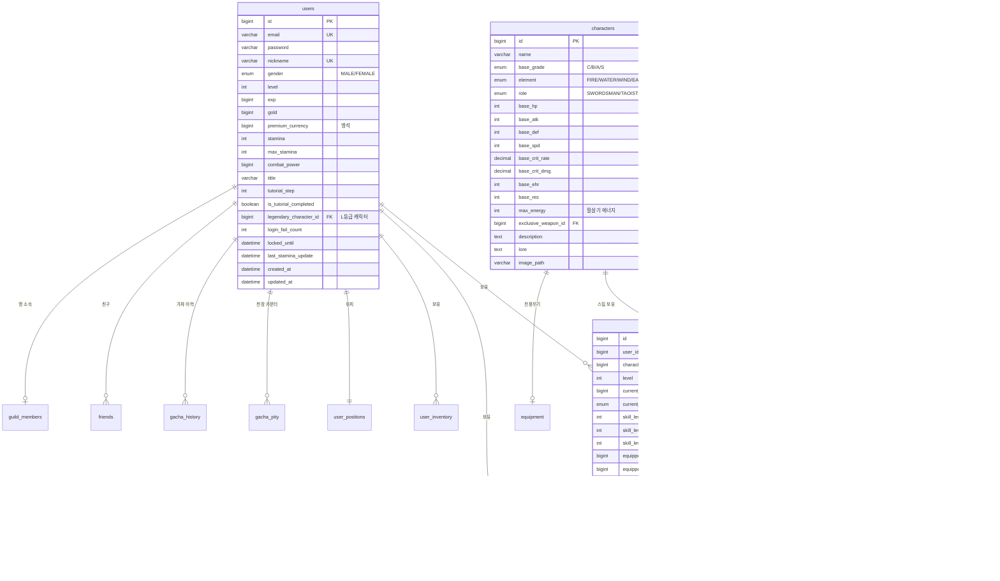
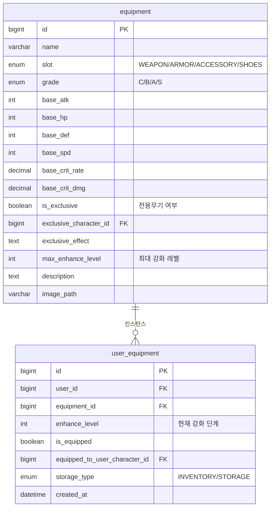
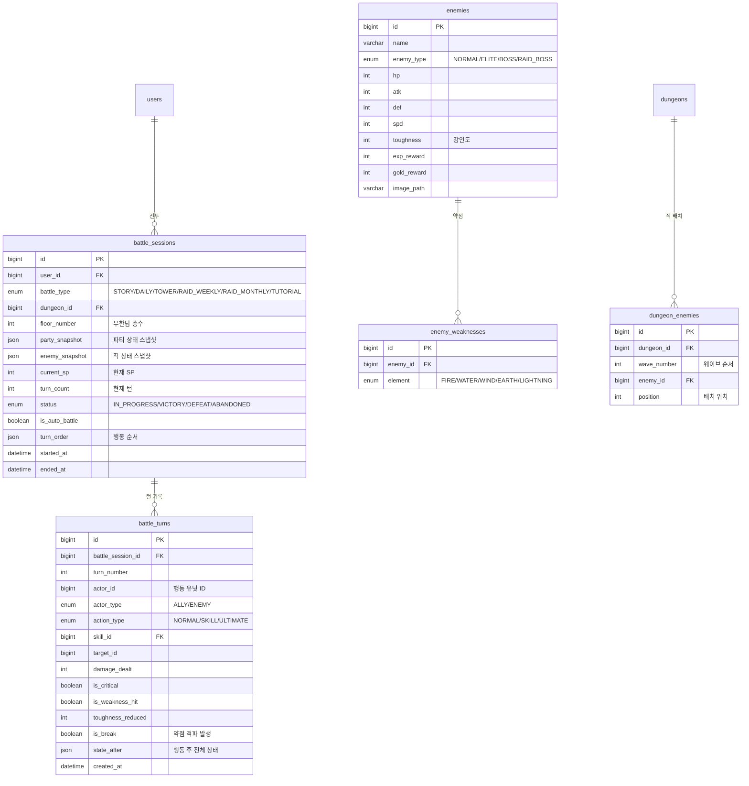
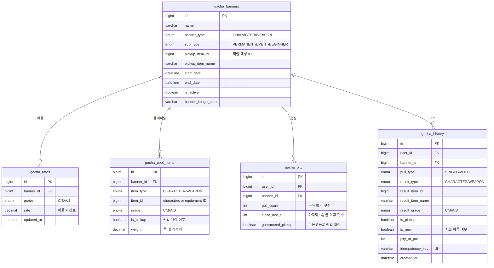
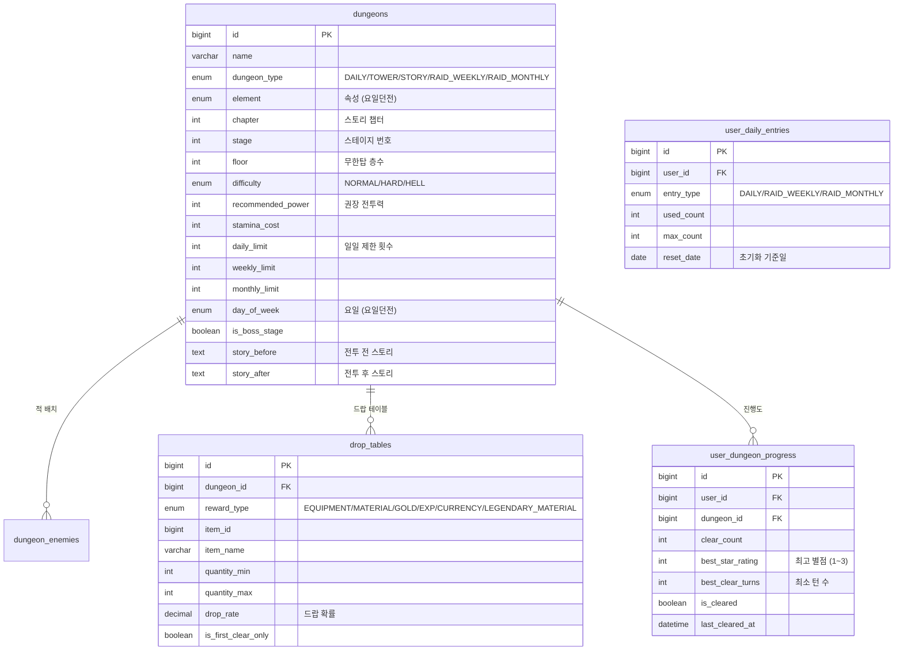
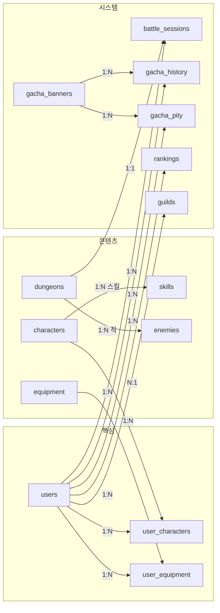

# 🗄️ Phase 2: 데이터베이스 & API 스키마 설계 (LLD)

> **프로젝트**: 한월(韓月)  
> **작성일**: 2026-05-06  
> **상태**: 🔶 모험가 승인 대기 중

---

## 1. ERD 전체 구조도

### 1-1. 유저 & 캐릭터 도메인



### 1-2. 장비 도메인



### 1-3. 전투 도메인



### 1-4. 가챠 도메인



### 1-5. 던전 & 레이드 도메인



### 1-6. 소셜 도메인

```mermaid
erDiagram
    guilds ||--o{ guild_members : "맹원"
    guilds ||--o{ guild_join_requests : "가입 신청"
    users ||--o{ friends : "친구"

    guilds {
        bigint id PK
        varchar name UK
        varchar description
        bigint leader_id FK
        int level
        bigint exp
        int max_members
        int member_count
        text notice "맹 공지"
        datetime created_at
    }

    guild_members {
        bigint id PK
        bigint guild_id FK
        bigint user_id FK UK
        enum role "LEADER/VICE_LEADER/ELDER/MEMBER"
        bigint contribution
        datetime joined_at
    }

    guild_join_requests {
        bigint id PK
        bigint guild_id FK
        bigint user_id FK
        enum status "PENDING/APPROVED/REJECTED"
        datetime requested_at
        datetime processed_at
    }

    friends {
        bigint id PK
        bigint user_id FK
        bigint friend_id FK
        enum status "PENDING/ACCEPTED"
        datetime created_at
    }
```

### 1-7. 랭킹 & 상점 도메인

```mermaid
erDiagram
    users ||--o{ rankings : "랭킹"
    users ||--o{ ranking_rewards : "보상"
    users ||--o{ user_purchase_history : "구매"

    rankings {
        bigint id PK
        bigint user_id FK
        enum ranking_type "TOWER/RAID_WEEKLY/RAID_MONTHLY/POWER"
        bigint record_value
        int season_id
        json party_snapshot
        datetime updated_at
    }

    ranking_rewards {
        bigint id PK
        bigint user_id FK
        enum ranking_type
        int season_id
        int final_rank
        boolean is_claimed
        datetime claimed_at
    }

    ranking_seasons {
        bigint id PK
        enum ranking_type
        int season_number
        datetime start_date
        datetime end_date
        boolean is_active
    }

    shop_items {
        bigint id PK
        varchar name
        enum shop_type "GOLD/MUHON"
        enum item_type "EQUIPMENT/CONSUMABLE/MATERIAL/TICKET"
        bigint item_reference_id
        int price
        enum currency_type "GOLD/MUHON"
        enum grade
        int monthly_limit
        boolean is_active
    }

    user_purchase_history {
        bigint id PK
        bigint user_id FK
        bigint shop_item_id FK
        int quantity
        int total_price
        date purchase_month "월간 제한 추적용"
        datetime purchased_at
    }

    user_positions {
        bigint id PK
        bigint user_id FK UK
        float pos_x
        float pos_y
        datetime updated_at
    }
```

---

## 2. 맵 시설 & 포탈 데이터

### 2-1. 맵 시설 마스터 테이블

```sql
CREATE TABLE map_facilities (
    id BIGINT PRIMARY KEY AUTO_INCREMENT,
    name VARCHAR(50) NOT NULL,
    facility_type ENUM('SHOP','ENHANCE','STORAGE','DUNGEON_PORTAL',
                       'RAID_PORTAL','GACHA','SOCIAL_PLAZA','RANKING_BOARD') NOT NULL,
    pos_x FLOAT NOT NULL,
    pos_y FLOAT NOT NULL,
    trigger_radius FLOAT NOT NULL DEFAULT 50.0,  -- 트리거 영역 반경(px)
    npc_name VARCHAR(50),
    npc_dialogue TEXT,
    icon_key VARCHAR(50),
    is_active BOOLEAN DEFAULT TRUE
);
```

### 2-2. 포탈 통신 규격 (JSON Schema)

#### 시설 접근 시 (Space키)

**요청:**
```json
POST /api/map/interact
{
    "facilityId": 3,
    "playerPosition": { "x": 420.5, "y": 310.2 },
    "timestamp": 1746500000000
}
```

**응답 (성공):**
```json
{
    "success": true,
    "facilityType": "DUNGEON_PORTAL",
    "facilityName": "던전 입구",
    "availableOptions": [
        {
            "type": "DAILY",
            "name": "화염 수련장 (월)",
            "element": "FIRE",
            "difficulties": ["NORMAL", "HARD", "HELL"],
            "remainingEntries": 4,
            "staminaCost": { "NORMAL": 10, "HARD": 15, "HELL": 20 }
        },
        {
            "type": "TOWER",
            "name": "무한의 탑",
            "currentFloor": 47,
            "staminaCost": 0
        },
        {
            "type": "STORY",
            "name": "챕터 3: 마교의 그림자",
            "currentStage": "3-4",
            "staminaCost": 8
        }
    ]
}
```

#### 던전 입장 시

**요청:**
```json
POST /api/dungeon/daily/enter
{
    "dungeonId": 101,
    "difficulty": "HARD",
    "partyIds": [1, 5, 12, 8],
    "idempotencyKey": "uuid-xxxx-xxxx"
}
```

**응답:**
```json
{
    "battleSessionId": 98765,
    "dungeon": {
        "id": 101,
        "name": "화염 수련장",
        "difficulty": "HARD",
        "element": "FIRE"
    },
    "party": [
        {
            "userCharacterId": 1,
            "name": "남궁화련",
            "grade": "S",
            "element": "LIGHTNING",
            "role": "SWORDSMAN",
            "level": 60,
            "hp": 12000, "maxHp": 12000,
            "atk": 2800, "def": 1200, "spd": 115,
            "energy": 0, "maxEnergy": 120,
            "skills": [
                { "id": 1, "name": "뇌전일섬", "type": "NORMAL", "spCost": -1 },
                { "id": 2, "name": "상승검법", "type": "BATTLE", "spCost": 1 },
                { "id": 3, "name": "만뇌귀종", "type": "ULTIMATE", "energyCost": 120 }
            ]
        }
    ],
    "enemies": [
        {
            "id": 201,
            "name": "화염 수련병",
            "type": "NORMAL",
            "hp": 8000, "maxHp": 8000,
            "atk": 1500, "def": 800, "spd": 95,
            "toughness": 60, "maxToughness": 60,
            "weaknesses": ["WATER", "EARTH"],
            "position": 1
        }
    ],
    "initialSp": 3,
    "maxSp": 5,
    "turnOrder": [
        { "id": 1, "name": "남궁화련", "type": "ALLY", "gauge": 8700 },
        { "id": 201, "name": "화염 수련병", "type": "ENEMY", "gauge": 9500 }
    ],
    "staminaRemaining": 75
}
```

---

## 3. 핵심 API 상세 명세

### 3-1. 인증 API

| Method | Endpoint | 설명 | Request Body | Response |
|--------|----------|------|-------------|----------|
| POST | `/api/auth/register` | 회원가입 | `{email, password, nickname}` | `{userId, nickname}` |
| POST | `/api/auth/login` | 로그인 | `{email, password, rememberMe}` | `{userId, nickname, level}` |
| POST | `/api/auth/logout` | 로그아웃 | - | `{success}` |
| GET | `/api/auth/check-email` | 이메일 중복체크 | `?email=xxx` | `{available: boolean}` |
| GET | `/api/auth/check-nickname` | 닉네임 중복체크 | `?nickname=xxx` | `{available: boolean}` |

### 3-2. 유저 & 캐릭터 API

| Method | Endpoint | 설명 |
|--------|----------|------|
| GET | `/api/user/profile` | 내 프로필 (재화, 레벨 등) |
| GET | `/api/user/characters` | 보유 캐릭터 목록 |
| GET | `/api/user/characters/{id}` | 캐릭터 상세 (스탯, 장비, 스킬) |
| POST | `/api/user/characters/{id}/level-up` | 캐릭터 레벨업 |
| POST | `/api/user/characters/{id}/upgrade-to-u` | S→U 등급 승급 |
| POST | `/api/user/characters/{id}/upgrade-to-l` | U→L 등급 승급 (계정당 1개 검증) |
| POST | `/api/user/characters/{id}/downgrade-to-u` | L→U 등급 강등 |

### 3-3. 전투 API

| Method | Endpoint | 설명 |
|--------|----------|------|
| POST | `/api/battle/start` | 전투 시작 |
| GET | `/api/battle/{id}/state` | 전투 상태 조회 |
| POST | `/api/battle/{id}/action` | 행동 실행 |
| POST | `/api/battle/{id}/ultimate` | 필살기 (인터럽트) |
| POST | `/api/battle/{id}/auto-toggle` | 자동전투 토글 |
| POST | `/api/battle/{id}/retreat` | 전투 포기 |
| GET | `/api/battle/{id}/result` | 전투 결과/보상 |

#### 전투 행동 요청 상세

```json
POST /api/battle/{battleId}/action
{
    "characterId": 1,
    "actionType": "SKILL",
    "skillId": 201,
    "targetId": 3
}
```

#### 전투 행동 응답 상세

```json
{
    "turnNumber": 7,
    "actor": {
        "id": 1, "name": "남궁화련", "type": "ALLY"
    },
    "action": {
        "type": "SKILL",
        "skillName": "상승검법",
        "element": "LIGHTNING"
    },
    "results": [
        {
            "targetId": 3,
            "targetName": "마교도",
            "damage": 3850,
            "isCritical": true,
            "isWeaknessHit": true,
            "toughnessReduced": 20,
            "isBreak": true,
            "breakEffect": {
                "type": "SHOCK",
                "duration": 2,
                "dotDamage": 240
            },
            "targetHp": { "current": 2150, "max": 12000 },
            "targetToughness": { "current": 0, "max": 60 }
        }
    ],
    "resourceChanges": {
        "spBefore": 3, "spAfter": 2,
        "energyBefore": 85, "energyAfter": 115,
        "ultimateReady": false
    },
    "turnOrder": [
        { "id": 201, "name": "수련병A", "type": "ENEMY", "gauge": 9900 },
        { "id": 1, "name": "남궁화련", "type": "ALLY", "gauge": 2500 }
    ],
    "battleStatus": "IN_PROGRESS",
    "statusEffects": [
        { "targetId": 3, "effect": "BREAK", "remainingTurns": 1 },
        { "targetId": 3, "effect": "SHOCK", "remainingTurns": 2 }
    ]
}
```

### 3-4. 가챠 API

| Method | Endpoint | 설명 |
|--------|----------|------|
| GET | `/api/gacha/banners` | 활성 배너 목록 |
| GET | `/api/gacha/banners/{id}/detail` | 배너 상세 (확률표, 풀 목록) |
| POST | `/api/gacha/pull` | 뽑기 (single/multi) |
| GET | `/api/gacha/pity/{bannerId}` | 천장 카운터 |
| GET | `/api/gacha/history` | 가챠 이력 |

#### 뽑기 요청/응답

```json
POST /api/gacha/pull
{
    "bannerId": 1001,
    "pullType": "MULTI",
    "idempotencyKey": "uuid-xxxx"
}
```

```json
{
    "success": true,
    "results": [
        {
            "index": 1,
            "type": "CHARACTER",
            "itemId": 15,
            "name": "당소소",
            "grade": "B",
            "element": "LIGHTNING",
            "role": "ASSASSIN",
            "isNew": false,
            "isDuplicate": true,
            "duplicateConversion": { "type": "MUHON", "amount": 10 }
        },
        {
            "index": 10,
            "type": "CHARACTER",
            "itemId": 28,
            "name": "제갈명",
            "grade": "S",
            "element": "WIND",
            "role": "TAOIST",
            "isNew": true,
            "isDuplicate": false,
            "isPickup": true
        }
    ],
    "pityInfo": {
        "currentCount": 45,
        "sinceLast_S": 0,
        "guaranteedPickup": false,
        "nextSoftPity": 70,
        "nextHardPity": 90
    },
    "currencyRemaining": {
        "premiumCurrency": 3200
    }
}
```

### 3-5. 맵 & 이동 API

| Method | Endpoint | 설명 |
|--------|----------|------|
| GET | `/api/map/town` | 마을 데이터 (시설 위치, 트리거 영역) |
| GET | `/api/map/position` | 현재 위치 조회 |
| POST | `/api/map/position` | 위치 업데이트 (1초 throttle) |
| POST | `/api/map/interact` | 시설 상호작용 |

### 3-6. 던전 & 레이드 API

| Method | Endpoint | 설명 |
|--------|----------|------|
| GET | `/api/dungeon/daily` | 오늘 요일던전 목록 |
| GET | `/api/dungeon/daily/entries` | 남은 입장 횟수 |
| POST | `/api/dungeon/enter` | 던전 입장 |
| GET | `/api/tower/info` | 무한탑 현재 층수 |
| POST | `/api/tower/enter` | 무한탑 입장 |
| GET | `/api/story/progress` | 스토리 진행 상황 |
| POST | `/api/story/enter` | 스토리 던전 입장 |
| GET | `/api/raid/info` | 레이드 정보 + 남은 횟수 |
| POST | `/api/raid/enter` | 레이드 입장 |

### 3-7. 장비 & 강화 API

| Method | Endpoint | 설명 |
|--------|----------|------|
| GET | `/api/equipment` | 보유 장비 목록 |
| POST | `/api/equipment/{id}/enhance` | 장비 강화 |
| POST | `/api/equipment/{id}/equip` | 장비 장착 |
| POST | `/api/equipment/{id}/unequip` | 장비 해제 |

### 3-8. 상점 & 인벤토리 API

| Method | Endpoint | 설명 |
|--------|----------|------|
| GET | `/api/shop/gold` | 골드 상점 품목 |
| GET | `/api/shop/muhon` | 무혼 상점 품목 |
| POST | `/api/shop/buy` | 구매 |
| GET | `/api/inventory` | 인벤토리 |
| POST | `/api/inventory/sell` | 아이템 판매 |
| GET | `/api/storage` | 보관함 |
| POST | `/api/storage/deposit` | 인벤→보관함 |
| POST | `/api/storage/withdraw` | 보관함→인벤 |
| GET | `/api/currency` | 재화 현황 |
| POST | `/api/stamina/recharge` | 스태미나 충전 |

### 3-9. 소셜 API

| Method | Endpoint | 프로토콜 |
|--------|----------|----------|
| WS | `/ws/chat` | WebSocket CONNECT |
| WS | `/topic/chat/global` | 전체 채팅 구독 |
| WS | `/topic/chat/guild/{id}` | 맹 채팅 구독 |
| WS | `/topic/chat/whisper/{userId}` | 귓속말 구독 |
| WS | `/topic/alerts` | 시스템 알림 구독 |
| WS | `/app/chat/send` | 메시지 전송 |
| REST | `/api/guild` | 맹 CRUD |
| REST | `/api/friends` | 친구 CRUD |

### 3-10. 랭킹 API

| Method | Endpoint | 설명 |
|--------|----------|------|
| GET | `/api/ranking/tower` | 무한탑 랭킹 |
| GET | `/api/ranking/raid/weekly` | 주간 레이드 랭킹 |
| GET | `/api/ranking/raid/monthly` | 월간 레이드 랭킹 |
| GET | `/api/ranking/power` | 전투력 랭킹 |
| GET | `/api/ranking/my` | 내 랭킹 현황 |
| GET | `/api/ranking/party/{userId}` | 유저 파티 조회 |
| POST | `/api/ranking/rewards/claim` | 랭킹 보상 수령 |

---

## 4. 테이블 간 핵심 관계 요약



---

## 5. 인덱스 전략

### 자주 조회되는 쿼리 기반 인덱스

```sql
-- 유저 관련
CREATE INDEX idx_users_email ON users(email);
CREATE INDEX idx_users_nickname ON users(nickname);

-- 유저 캐릭터
CREATE INDEX idx_user_chars_user ON user_characters(user_id);
CREATE INDEX idx_user_chars_grade ON user_characters(user_id, current_grade);

-- 유저 장비
CREATE INDEX idx_user_equip_user ON user_equipment(user_id);
CREATE INDEX idx_user_equip_storage ON user_equipment(user_id, storage_type);

-- 전투
CREATE INDEX idx_battle_user_status ON battle_sessions(user_id, status);

-- 가챠
CREATE INDEX idx_gacha_pity_user_banner ON gacha_pity(user_id, banner_id);
CREATE INDEX idx_gacha_history_user ON gacha_history(user_id, created_at DESC);

-- 랭킹
CREATE INDEX idx_ranking_type_season ON rankings(ranking_type, season_id, record_value DESC);

-- 길드
CREATE INDEX idx_guild_member_user ON guild_members(user_id);

-- 던전 진행
CREATE INDEX idx_dungeon_progress_user ON user_dungeon_progress(user_id, dungeon_id);

-- 일일/주간 입장 횟수
CREATE INDEX idx_daily_entries_user ON user_daily_entries(user_id, entry_type, reset_date);
```

---

> 📌 **다음 단계**: Phase 2 승인 후 → **Phase 3: 전장 및 월드맵 UI/UX 설계**로 진행
