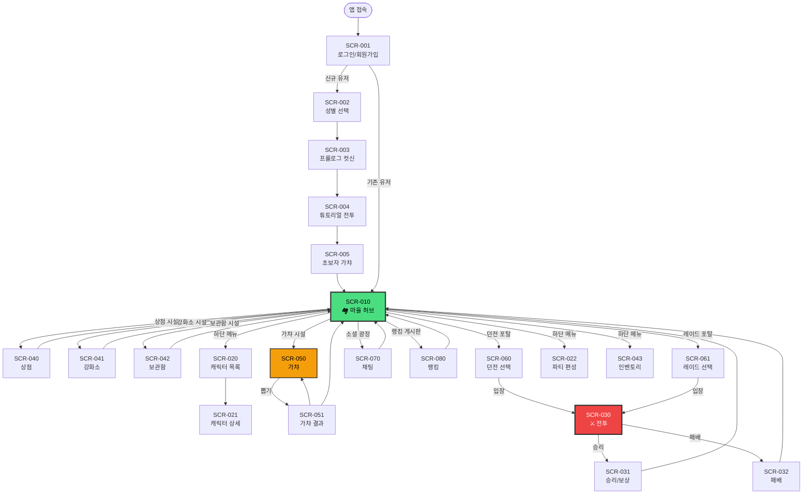

# 🎨 Phase 3: UI/UX 화면 설계

> **프로젝트**: 한월(韓月)  
> **작성일**: 2026-05-06  
> **상태**: 🔶 모험가 승인 대기 중

---

## 1. 화면 목록 (Screen List)

| 화면 ID | 화면명 | 진입 경로 | 우선순위 |
|---------|--------|-----------|:--------:|
| SCR-001 | 로그인 / 회원가입 | 최초 접속 | 🔴 |
| SCR-002 | 성별 선택 | 회원가입 후 (최초 1회) | 🔴 |
| SCR-003 | 튜토리얼 (프롤로그 컷신) | 성별 선택 후 | 🔴 |
| SCR-004 | 튜토리얼 (전투) | 프롤로그 완료 후 | 🔴 |
| SCR-005 | 초보자 가챠 | 튜토리얼 전투 완료 후 | 🔴 |
| SCR-010 | **마을 허브 (메인)** | 튜토리얼 후 / 로그인 후 | 🔴 |
| SCR-020 | 캐릭터 목록 | 하단 메뉴 | 🔴 |
| SCR-021 | 캐릭터 상세 | 캐릭터 목록에서 선택 | 🔴 |
| SCR-022 | 파티 편성 | 하단 메뉴 | 🔴 |
| SCR-030 | **전투 화면** | 던전/레이드 입장 | 🔴 |
| SCR-031 | 전투 결과 (승리) | 전투 종료 | 🔴 |
| SCR-032 | 전투 결과 (패배) | 전투 종료 | 🔴 |
| SCR-040 | 상점 | 마을 상점 시설 | 🔴 |
| SCR-041 | 강화소 | 마을 강화소 시설 | 🔴 |
| SCR-042 | 보관함 | 마을 보관함 시설 | 🔴 |
| SCR-043 | 인벤토리 | 하단 메뉴 | 🔴 |
| SCR-050 | **가챠 화면** | 마을 가챠 시설 | 🔴 |
| SCR-051 | 가챠 결과 연출 | 뽑기 실행 후 | 🔴 |
| SCR-060 | 던전 선택 (포탈) | 마을 던전 포탈 | 🔴 |
| SCR-061 | 레이드 선택 (포탈) | 마을 레이드 포탈 | 🔴 |
| SCR-070 | 채팅 패널 | 마을 소셜 광장 / 상시 | 🔴 |
| SCR-080 | 랭킹 보드 | 마을 랭킹 게시판 | 🔴 |
| SCR-090 | 맹(길드) 화면 | 채팅 또는 메뉴 | 🟡 |
| SCR-091 | 친구 목록 | 메뉴 | 🟡 |
| SCR-100 | 설정 | 메뉴 | 🟡 |
| SCR-101 | 프로필 | 메뉴 | 🟡 |

---

## 2. 화면 이동 경로 (Screen Flow)



---

## 3. 핵심 화면 상세 설계

### SCR-010: 마을 허브 (메인 화면) 🏘️

> 게임의 **중심 화면**. HTML5 Canvas 위에 UI 레이어가 오버레이.

```
┌──────────────────────────────────────────────────────┐
│ ┌─ 상단 HUD ───────────────────────────────────────┐ │
│ │ [미니맵]     Lv.35 남궁화련     💰12,500  💎320  ⚡85│ │
│ └──────────────────────────────────────────────────┘ │
│                                                       │
│ ┌─ Canvas 영역 ────────────────────────────────────┐ │
│ │                                                    │ │
│ │    🏪상점        ┌─────┐           🎰가챠         │ │
│ │                  │ NPC │                           │ │
│ │         🔨강화소  └─────┘    📦보관함              │ │
│ │                                                    │ │
│ │              💬 소셜 광장                           │ │
│ │               (유저들)                             │ │
│ │                                                    │ │
│ │    🌀던전         ⚙️          ⚔️레이드             │ │
│ │    포탈       캐릭터(나)         포탈               │ │
│ │                                                    │ │
│ │              🏆 랭킹 게시판                        │ │
│ │                                                    │ │
│ └────────────────────────────────────────────────────┘ │
│                                                       │
│ ┌─ 하단 메뉴 바 ───────────────────────────────────┐ │
│ │ [👤캐릭터] [⚔파티] [📦인벤] [💬채팅] [⚙설정]      │ │
│ └──────────────────────────────────────────────────┘ │
│                                                       │
│ ┌─ 채팅 (접이식) ──────────────────────────────────┐ │
│ │ [전체|맹|귓말]  "레이드 같이 ㄱ" ...  [입력] [전송]│ │
│ └──────────────────────────────────────────────────┘ │
└──────────────────────────────────────────────────────┘
```

#### Canvas 레이어 구성

```
Layer 4 (최상위) ─── UI 오버레이 (HTML/CSS)
                     미니맵, 재화, 메뉴 버튼
                     시설 상호작용 말풍선

Layer 3 ──────────── 캐릭터 레이어
                     내 캐릭터 스프라이트
                     NPC 스프라이트

Layer 2 ──────────── 오브젝트 레이어
                     시설 건물, 포탈 이펙트
                     트리거 영역 (디버그 시 표시)

Layer 1 (최하위) ─── 배경 레이어
                     마을 바닥 타일, 풍경
```

#### 시설 접근 시 상호작용

```
┌──────────────────────────┐
│   [Space] 상점 입장       │  ← 시설 근접 시 말풍선
│   "어서오게, 뭘 찾나?"     │
└──────────────────────────┘
       ▲
      ⚙️ (캐릭터)
```

---

### SCR-030: 전투 화면 ⚔️

```
┌──────────────────────────────────────────────────────┐
│ ┌─ 턴 순서 바 ─────────────────────────────────────┐ │
│ │ [🟢남궁] [🔴수련병A] [🟢당소소] [🔴수련병B] [🟢제갈] │ │
│ └──────────────────────────────────────────────────┘ │
│                                                       │
│ ┌─ 전투 필드 ──────────────────────────────────────┐ │
│ │                                                    │ │
│ │         ┌──────┐  ┌──────┐  ┌──────┐             │ │
│ │         │ 적 1  │  │ 적 2  │  │ 적 3  │             │ │
│ │         │🔥💧  │  │💧⚡  │  │🔥🌿  │  ← 약점     │ │
│ │         │▓▓▓░░│  │▓▓▓▓░│  │▓▓░░░│  ← 강인도   │ │
│ │         │HP████│  │HP██░░│  │HP███░│  ← HP      │ │
│ │         └──────┘  └──────┘  └──────┘             │ │
│ │                                                    │ │
│ │  ┌──────┐ ┌──────┐ ┌──────┐ ┌──────┐            │ │
│ │  │ 아군1 │ │ 아군2 │ │ 아군3 │ │ 아군4 │            │ │
│ │  │남궁화련│ │당소소  │ │제갈명 │ │혜선   │            │ │
│ │  │⚡검객 │ │⚡암기 │ │🌿도사│ │💧의선│            │ │
│ │  │HP████│ │HP███░│ │HP████│ │HP████│            │ │
│ │  │EN▓▓░░│ │EN▓░░░│ │EN▓▓▓░│ │EN▓▓░░│ ← 에너지  │ │
│ │  └──────┘ └──────┘ └──────┘ └──────┘            │ │
│ └────────────────────────────────────────────────────┘ │
│                                                       │
│ ┌─ SP & 행동 패널 ─────────────────────────────────┐ │
│ │                                                    │ │
│ │  SP: ●●●○○                     [🔄 자동전투 OFF]  │ │
│ │                                                    │ │
│ │  ┌────────────┐  ┌────────────┐                  │ │
│ │  │ ⚔️ 일반공격 │  │ 💥 전투스킬 │                  │ │
│ │  │   SP +1     │  │   SP -1     │                  │ │
│ │  └────────────┘  └────────────┘                  │ │
│ │                                                    │ │
│ │  ┌────────────┐  필살기는 에너지 100% 시            │ │
│ │  │ 🌟 필살기   │  캐릭터 초상화 위에 별 표시         │ │
│ │  │ 턴 무시 발동 │  → 클릭하면 즉시 발동              │ │
│ │  └────────────┘                                   │ │
│ └────────────────────────────────────────────────────┘ │
│                                                       │
│ ┌─ 전투 로그 (접이식) ─────────────────────────────┐ │
│ │ Turn 5: 남궁화련 → 상승검법 → 수련병A (3,850 CRIT!)│ │
│ │ Turn 5: 수련병A 약점 격파! (감전 2턴)              │ │
│ └──────────────────────────────────────────────────┘ │
└──────────────────────────────────────────────────────┘
```

#### 필살기 인터럽트 UI

```
적 턴 진행 중 에너지 100% 캐릭터 발견 시:

  ┌────────────────────────────┐
  │ 🌟 남궁화련 필살기 준비!    │
  │ [발동] 으로 즉시 사용       │
  │ (적 턴을 끊고 끼어듦)       │
  └────────────────────────────┘
         ↑
  남궁화련 초상화에 ✨ 글로우 이펙트
```

---

### SCR-050: 가챠 화면 🎰

```
┌──────────────────────────────────────────────────────┐
│ ┌─ 배너 선택 탭 ───────────────────────────────────┐ │
│ │ [캐릭터 상시] [캐릭터 이벤트🔥] [무기 상시] [무기 이벤]│ │
│ └──────────────────────────────────────────────────┘ │
│                                                       │
│ ┌─ 배너 일러스트 ──────────────────────────────────┐ │
│ │                                                    │ │
│ │     ╔══════════════════════════════════╗           │ │
│ │     ║   🔥 이벤트 픽업 가챠 🔥          ║           │ │
│ │     ║                                  ║           │ │
│ │     ║    ★ S급 제갈명 픽업 ★            ║           │ │
│ │     ║    [캐릭터 일러스트]               ║           │ │
│ │     ║                                  ║           │ │
│ │     ║    남은 기간: 12일 04:32:15       ║           │ │
│ │     ╚══════════════════════════════════╝           │ │
│ └────────────────────────────────────────────────────┘ │
│                                                       │
│ ┌─ 정보 패널 ──────────────────────────────────────┐ │
│ │  천장: 45/90  │  보유 영석: 💎 3,200              │ │
│ │  S등급 확률: 0.5% (소프트 천장 70회~)              │ │
│ └──────────────────────────────────────────────────┘ │
│                                                       │
│ ┌─ 뽑기 버튼 ──────────────────────────────────────┐ │
│ │                                                    │ │
│ │   ┌─────────────────┐  ┌─────────────────┐       │ │
│ │   │   1회 뽑기        │  │  10연차 뽑기     │       │ │
│ │   │   💎 160          │  │  💎 1,600        │       │ │
│ │   └─────────────────┘  └─────────────────┘       │ │
│ │                                                    │ │
│ │   [확률표 보기]  [보유 목록]  [가챠 이력]           │ │
│ └────────────────────────────────────────────────────┘ │
└──────────────────────────────────────────────────────┘
```

#### 가챠 결과 연출 (SCR-051)

```
[10연차 결과 화면]

┌──────────────────────────────────────────────────────┐
│                                                       │
│   ┌────┐ ┌────┐ ┌────┐ ┌────┐ ┌────┐              │
│   │ ?? │ │ ?? │ │ ?? │ │ ?? │ │ ?? │  ← 미공개 카드 │
│   │    │ │    │ │    │ │    │ │    │                │
│   └────┘ └────┘ └────┘ └────┘ └────┘              │
│   ┌────┐ ┌────┐ ┌────┐ ┌────┐ ┌────┐              │
│   │ ?? │ │ ?? │ │ ?? │ │ ?? │ │ ?? │                │
│   │    │ │    │ │    │ │    │ │    │                │
│   └────┘ └────┘ └────┘ └────┘ └────┘              │
│                                                       │
│              [탭하여 공개]                             │
│               또는 [전체 공개]                         │
└──────────────────────────────────────────────────────┘

↓ 카드 터치 시 (CSS 3D Transform)

┌──────────────────────────────────────────────────────┐
│                                                       │
│   ┌────┐ ┌────┐ ╔════╗ ┌────┐ ┌────┐              │
│   │ C  │ │ B  │ ║ S  ║ │ B  │ │ A  │              │
│   │당소소│ │무명검│ ║제갈명║ │호위대│ │검강  │              │
│   └────┘ └────┘ ╚════╝ └────┘ └────┘              │
│                  ↑ 황금 글로우 + 파티클               │
│   ┌────┐ ┌────┐ ┌────┐ ┌────┐ ┌────┐              │
│   │ C  │ │ C  │ │ B  │ │ A  │ │ C  │              │
│   │...  │ │...  │ │...  │ │...  │ │...  │              │
│   └────┘ └────┘ └────┘ └────┘ └────┘              │
│                                                       │
│        [다시 뽑기 💎1,600]    [확인]                   │
└──────────────────────────────────────────────────────┘
```

---

### SCR-020: 캐릭터 목록

```
┌──────────────────────────────────────────────────────┐
│  ← 뒤로   👤 캐릭터 목록                [필터] [정렬] │
│                                                       │
│  필터: [전체] [🔥불] [💧물] [🌿바람] [🪨땅] [⚡번개]   │
│        [검객] [도사] [의선] [암기사] [호위무사]        │
│                                                       │
│  ┌─ Bento Grid ────────────────────────────────────┐ │
│  │ ┌────────────┐ ┌────────────┐ ┌────────────┐   │ │
│  │ │ ⚡ S        │ │ 🌿 A        │ │ 💧 B        │   │ │
│  │ │ [일러스트]   │ │ [일러스트]   │ │ [일러스트]   │   │ │
│  │ │ 남궁화련    │ │ 제갈명       │ │ 당소소       │   │ │
│  │ │ Lv.60 검객  │ │ Lv.45 도사  │ │ Lv.38 암기  │   │ │
│  │ │ 전투력 8,500│ │ 전투력 5,200│ │ 전투력 3,100│   │ │
│  │ │ 🟨 금테두리 │ │ 🟪 보라테   │ │ 🟦 파란테   │   │ │
│  │ └────────────┘ └────────────┘ └────────────┘   │ │
│  │ ┌────────────┐ ┌────────────┐ ┌────────────┐   │ │
│  │ │ ⚡ U 🔴     │ │ 🔥 A        │ │ 🪨 S        │   │ │
│  │ │ [일러스트]   │ │ [일러스트]   │ │ [일러스트]   │   │ │
│  │ │ 혜선        │ │ 모용비       │ │ 팽대산       │   │ │
│  │ │ Lv.75 의선  │ │ Lv.42 도사  │ │ Lv.55 호위  │   │ │
│  │ │ 전투력 9,800│ │ 전투력 4,800│ │ 전투력 7,200│   │ │
│  │ │ 🟥 빨간테   │ │ 🟪 보라테   │ │ 🟨 금테두리 │   │ │
│  │ └────────────┘ └────────────┘ └────────────┘   │ │
│  └────────────────────────────────────────────────┘ │
│                                                       │
│  보유: 12/50   전투력 합계: 42,600                    │
└──────────────────────────────────────────────────────┘
```

---

### SCR-060: 던전 선택 (포탈)

```
┌──────────────────────────────────────────────────────┐
│  ← 뒤로   🌀 던전 입구                               │
│                                                       │
│  ┌─ 탭 ────────────────────────────────────────────┐ │
│  │ [요일 던전🔥] [무한의 탑🏔️] [스토리 던전📖]        │ │
│  └──────────────────────────────────────────────────┘ │
│                                                       │
│  ── 요일 던전 (화요일: 수류 비경) ──                    │
│                                                       │
│  ┌──────────────────────────────────────────────────┐ │
│  │  💧 수류 비경                                     │ │
│  │  "물 속성 승급 재료를 획득할 수 있는 수련장"        │ │
│  │                                                    │ │
│  │  ┌────────────┐┌────────────┐┌────────────┐     │ │
│  │  │ ⭐ 일반     ││ ⭐⭐ 어려움 ││ ⭐⭐⭐ 지옥 │     │ │
│  │  │ 권장: 1,000 ││ 권장: 3,000 ││ 권장: 8,000 │     │ │
│  │  │ ⚡10        ││ ⚡15        ││ ⚡20        │     │ │
│  │  │ [입장]      ││ [입장]      ││ 🔒미해금    │     │ │
│  │  └────────────┘└────────────┘└────────────┘     │ │
│  │                                                    │ │
│  │  남은 입장 횟수: 4/6                               │ │
│  └──────────────────────────────────────────────────┘ │
│                                                       │
│  ── 내일 던전 미리보기 ──                               │
│  🌿 질풍 협곡 (수요일) - 바람 속성 재료                 │
│                                                       │
│  파티: [남궁화련][당소소][제갈명][혜선]  [편성 변경]     │
│  전투력: 32,500                                       │
└──────────────────────────────────────────────────────┘
```

---

### SCR-080: 랭킹 보드

```
┌──────────────────────────────────────────────────────┐
│  ← 뒤로   🏆 랭킹 보드             초기화: 25일 남음  │
│                                                       │
│  ┌─ 탭 ────────────────────────────────────────────┐ │
│  │ [🏔️무한의탑] [⚔️주간레이드] [⚔️월간레이드] [💪전투력]│ │
│  └──────────────────────────────────────────────────┘ │
│                                                       │
│  ┌─ TOP 3 ─────────────────────────────────────────┐ │
│  │      🥈              🥇              🥉          │ │
│  │   제갈신산         남궁무적          당가비검       │ │
│  │   121층            127층            118층         │ │
│  │   [파티보기]       [파티보기]        [파티보기]     │ │
│  └──────────────────────────────────────────────────┘ │
│                                                       │
│  ┌─ 순위 리스트 ───────────────────────────────────┐ │
│  │ 4.  모용복수     115층  전투력 45,200  [파티보기] │ │
│  │ 5.  소림혜능     112층  전투력 43,800  [파티보기] │ │
│  │ 6.  화산검선     108층  전투력 41,500  [파티보기] │ │
│  │ 7.  무당현도     105층  전투력 40,200  [파티보기] │ │
│  │ ...                                              │ │
│  └──────────────────────────────────────────────────┘ │
│                                                       │
│  ┌─ 내 순위 (고정) ────────────────────────────────┐ │
│  │ 42위  한태  87층  전투력 32,500                   │ │
│  └──────────────────────────────────────────────────┘ │
└──────────────────────────────────────────────────────┘
```

---

## 4. 디자인 시스템 토큰

### 4-1. 등급별 컬러

| 등급 | 배경 | 테두리 | 글로우 | 텍스트 |
|:----:|------|--------|--------|--------|
| C | `#2d2d2d` | `#6b7280` Gray | 없음 | `#9ca3af` |
| B | `#1e293b` | `#3b82f6` Blue | 약한 파란 | `#60a5fa` |
| A | `#2d1b4e` | `#8b5cf6` Purple | 보라 | `#a78bfa` |
| S | `#3d2800` | `#f59e0b` Gold | 강한 황금 | `#fbbf24` |
| U | `#3b0000` | `#ef4444` Red | 강한 빨강 | `#f87171` |
| L | `#003d00` | `#22c55e` Green | 강한 초록 + 파티클 | `#4ade80` |

### 4-2. 속성별 컬러

| 속성 | 메인 컬러 | 서브 컬러 | 아이콘 |
|:----:|-----------|-----------|:------:|
| 🔥 불 | `#ef4444` | `#fca5a5` | 🔥 |
| 💧 물 | `#3b82f6` | `#93c5fd` | 💧 |
| 🌿 바람 | `#22c55e` | `#86efac` | 🌿 |
| 🪨 땅 | `#a16207` | `#fbbf24` | 🪨 |
| ⚡ 번개 | `#a855f7` | `#d8b4fe` | ⚡ |

### 4-3. 타이포그래피

| 용도 | 폰트 | 크기 | 비고 |
|------|------|------|------|
| 기본 UI | Pretendard | 14px | 한글 가독성 |
| 제목/캐릭명 | Pretendard Bold | 18~24px | |
| 데미지 숫자 | Outfit (영문) | 28~36px | 전투 중 데미지 팝업 |
| 무협 스타일 | 나눔명조 or 궁서체 | 가변 | 스킬명, 등급명, 컷신 |
| 시스템 메시지 | Pretendard | 12px | 채팅, 로그 |

### 4-4. 공통 UI 컴포넌트

```
[버튼 스타일]
┌─────────────────┐
│  Primary (영석)  │  ← 그라디언트 황금, 글로우
├─────────────────┤
│  Secondary      │  ← 반투명 다크, 테두리
├─────────────────┤
│  Danger (확인)   │  ← 빨간 그라디언트
├─────────────────┤
│  Disabled       │  ← 회색, 비활성
└─────────────────┘

[카드 스타일 - Bento Grid]
┌────────────────┐
│ 등급 테두리 글로우 │
│ ┌──────────┐   │
│ │ 일러스트   │   │
│ └──────────┘   │
│ 이름  Lv.XX    │
│ 속성  직업     │
│ 전투력: X,XXX  │
└────────────────┘
  └─ 배경: 다크 글래스모피즘 (backdrop-blur)
```

---

## 5. 반응형 & 애니메이션 가이드

### 5-1. 반응형 기준

| 뷰포트 | 해상도 | 대응 |
|--------|--------|------|
| Desktop | 1280px+ | 풀 UI (기본) |
| Tablet | 768~1279px | Canvas 크기 축소, 사이드 채팅 접기 |
| Mobile | ~767px | 미지원 (향후 확장) |

### 5-2. 핵심 애니메이션

| 요소 | 효과 | 기술 |
|------|------|------|
| 가챠 카드 뒤집기 | Y축 180° 회전 | CSS `rotateY` + `perspective` |
| S등급 등장 | 황금 파티클 + 전체화면 플래시 | CSS `@keyframes` + Canvas particle |
| 데미지 팝업 | 숫자 위로 튀어올라 사라짐 | CSS `translateY` + `opacity` |
| 약점 격파 | 화면 흔들림 + 속성별 이펙트 | CSS `shake` animation |
| 캐릭터 이동 | 프레임 애니메이션 (스프라이트) | Canvas `drawImage` sprite sheet |
| 시설 접근 | 말풍선 페이드인 | CSS `fadeIn` |
| 레벨업 | 빛 기둥 + 문자 이펙트 | CSS particle + scale |

---

> 📌 **다음 단계**: Phase 3 승인 후 → **Phase 4: 방어 체계 & 인프라 설계 (NFR)**로 진행
