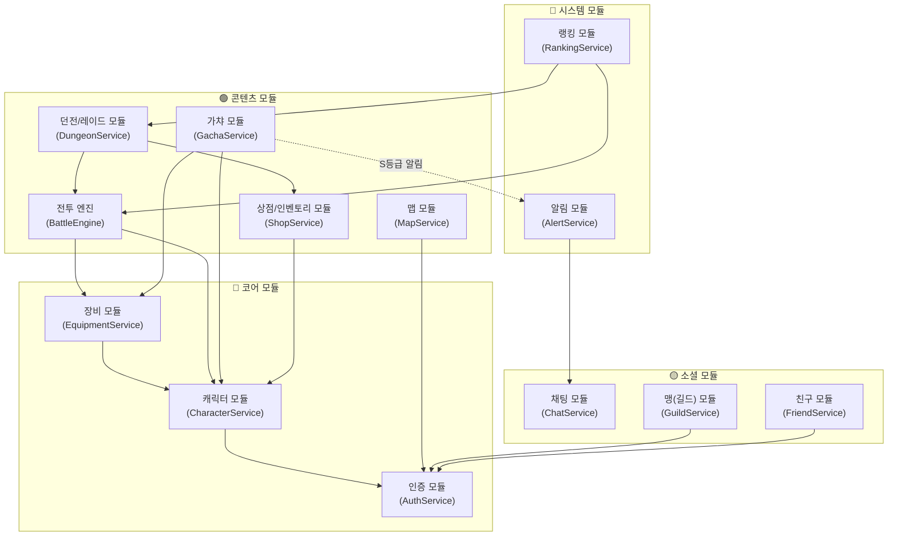
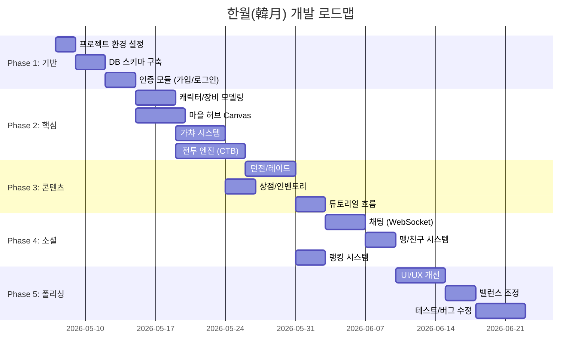

# 🏗️ Phase 5: 모듈 구조 & 개발 지침

> **프로젝트**: 한월(韓月)  
> **작성일**: 2026-05-06  
> **상태**: 🔶 모험가 승인 대기 중

---

## 1. 모듈별 역할 & 의존 관계

---

## 2. 모듈 상세 명세

### 🔵 코어 모듈

#### 인증 모듈 (AuthService)
| 역할 | 상세 |
|------|------|
| 담당 | 회원가입, 로그인/로그아웃, 세션 관리 |
| 의존 | Spring Security |
| 핵심 규칙 | BCrypt 패스워드 해싱, 5회 실패 시 30분 잠금 |
| 트랜잭션 | 회원가입: `@Transactional` (유저 생성 + 주인공 캐릭터 생성 + 초기 재화 지급) |

#### 캐릭터 모듈 (CharacterService)
| 역할 | 상세 |
|------|------|
| 담당 | 캐릭터 조회, 레벨업, 등급 승급(S→U→L), Variant 분기 |
| 의존 | 인증 모듈 |
| 핵심 규칙 | L등급은 계정당 1캐릭만 / 승급 시 재료+골드 원자적 차감 |
| Variant | 응답 시 `user.gender`에 따라 주인공 스킬 이름/속성 분기 |

#### 장비 모듈 (EquipmentService)
| 역할 | 상세 |
|------|------|
| 담당 | 장비 장착/해제, 강화, 전용무기 효과 적용 |
| 의존 | 캐릭터 모듈 |
| 핵심 규칙 | 강화 실패 시 단계 유지(하락 없음) / 등급 변경 불가 |
| 트랜잭션 | 강화: `@Transactional` (강화석+골드 차감 + 성공/실패 처리) |

---

### 🟢 콘텐츠 모듈

#### 전투 엔진 (BattleEngine)
| 역할 | 상세 |
|------|------|
| 담당 | CTB 턴 관리, 데미지 계산, 약점 격파, 필살기 인터럽트 |
| 의존 | 캐릭터 모듈, 장비 모듈 |
| 내부 구성 | TurnManager, DamageCalculator, WeaknessProcessor, SkillProcessor, AutoBattleAI |
| 핵심 규칙 | 서버 권위 — 모든 계산은 서버에서 수행, 클라이언트는 연출만 |
| 상태 관리 | BattleSession DB 저장 (새로고침 시에도 복원 가능) |

#### 가챠 모듈 (GachaService)
| 역할 | 상세 |
|------|------|
| 담당 | 뽑기 처리, 확률 엔진, 천장 관리, 중복 캐릭터 무혼 변환 |
| 의존 | 캐릭터 모듈, 장비 모듈, 알림 모듈 |
| 핵심 규칙 | `@Transactional(SERIALIZABLE)` — 재화 차감~결과 지급 원자적 |
| 보안 | 멱등성 키로 연타 방지 / `SELECT FOR UPDATE`로 재화 락 |

#### 던전/레이드 모듈 (DungeonService)
| 역할 | 상세 |
|------|------|
| 담당 | 입장 관리, 횟수 제한, 스태미나 차감, 보상 지급, 드랍 계산 |
| 의존 | 전투 엔진, 상점 모듈(보상 지급) |
| 핵심 규칙 | 입장 시 스태미나 차감 + 횟수 차감 원자적 / 클리어 시 보상 원자적 |
| L등급 재료 | 월간 레이드 drop_table에서 확률 드랍 |

#### 상점/인벤토리 모듈 (ShopService)
| 역할 | 상세 |
|------|------|
| 담당 | 골드 상점, 무혼 상점 구매, 인벤토리 관리, 보관함 이동 |
| 의존 | 캐릭터 모듈 |
| 핵심 규칙 | 월간 제한 품목: 매월 1일 초기화 / A등급 이상 장비 상점 판매 불가 |

#### 맵 모듈 (MapService)
| 역할 | 상세 |
|------|------|
| 담당 | 마을 시설 데이터 제공, 위치 업데이트, 시설 상호작용, 이동 검증 |
| 의존 | 인증 모듈 |
| 핵심 규칙 | 1초 Throttle 위치 업데이트 / 비정상 이동 탐지 시 롤백 |

---

### 🟡 소셜 모듈

#### 채팅 모듈 (ChatService)
| 역할 | 상세 |
|------|------|
| 담당 | 전체/맹/귓속말 채팅, 메시지 처리, 금칙어 필터 |
| 기술 | WebSocket + STOMP |
| 핵심 규칙 | 1초 도배 방지 / 금칙어 서버 필터링 / 메시지 100건 메모리 캐싱 |

#### 맹 모듈 (GuildService)
| 역할 | 상세 |
|------|------|
| 담당 | 맹 생성/가입/탈퇴, 직책 관리, 기여도 |
| 핵심 규칙 | 1인 1맹 / 탈퇴 후 24시간 쿨다운 / 맹주 양도 |

---

### 🔴 시스템 모듈

#### 랭킹 모듈 (RankingService)
| 역할 | 상세 |
|------|------|
| 담당 | 랭킹 집계, 시즌 관리, 보상 지급 |
| 핵심 규칙 | 전투력 랭킹은 1시간 배치 갱신 / 탑·레이드는 실시간 |

#### 알림 모듈 (AlertService)
| 역할 | 상세 |
|------|------|
| 담당 | S등급 가챠 전체채팅 알림, 시스템 공지 |
| 기술 | WebSocket `/topic/alerts`로 브로드캐스트 |

---

## 3. 개발 우선순위 로드맵

### 단계별 마일스톤

| 단계 | 목표 | 완료 시점 (예상) |
|:----:|------|:----------------:|
| **M1** | 로그인 → 마을 접속 → 걸어다닐 수 있음 | ~2주 |
| **M2** | 가챠 뽑기 + 캐릭터 확인 가능 | ~3주 |
| **M3** | 전투 1판 플레이 가능 (CTB 동작) | ~4주 |
| **M4** | 던전 입장 → 전투 → 보상 루프 완성 | ~5주 |
| **M5** | 채팅/맹/랭킹 소셜 기능 | ~6주 |
| **M6** | 튜토리얼 → 엔드 콘텐츠까지 풀 플레이 | ~8주 |

---

## 4. 코드 컨벤션 & 규칙

### 4-1. 네이밍 규칙

| 대상 | 규칙 | 예시 |
|------|------|------|
| 패키지 | 소문자, 도메인별 | `com.hanwol.domain.character` |
| 클래스 | PascalCase | `BattleEngine`, `GachaService` |
| 메서드 | camelCase, 동사 시작 | `pullGacha()`, `calculateDamage()` |
| 상수 | SCREAMING_SNAKE | `MAX_PARTY_SIZE = 4` |
| DB 테이블 | snake_case | `user_characters`, `gacha_pity` |
| DB 컬럼 | snake_case | `current_grade`, `base_atk` |
| API URL | kebab-case, 명사 복수형 | `/api/characters/{id}/level-up` |

### 4-2. 핵심 개발 규칙

1. **컨트롤러에 비즈니스 로직 금지** — 무조건 Service 레이어에 위임
2. **재화 변동은 반드시 `@Transactional`** — 예외 없음
3. **Entity에 비즈니스 메서드 작성** — `user.deductCurrency(amount)` 같은 도메인 메서드
4. **DTO와 Entity 분리** — Controller ↔ Service는 DTO, Service ↔ Repository는 Entity
5. **테스트**: 가챠 확률, 데미지 계산, 천장 시스템은 단위 테스트 필수

---

> 📌 **아키텍처 설계 5단계 전체 완료!**  
> 다음 단계: 개발 환경 설정 (Spring Boot 프로젝트 초기화)
